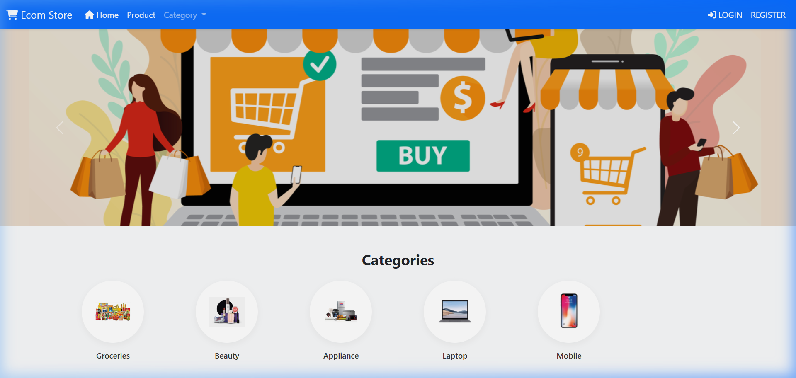
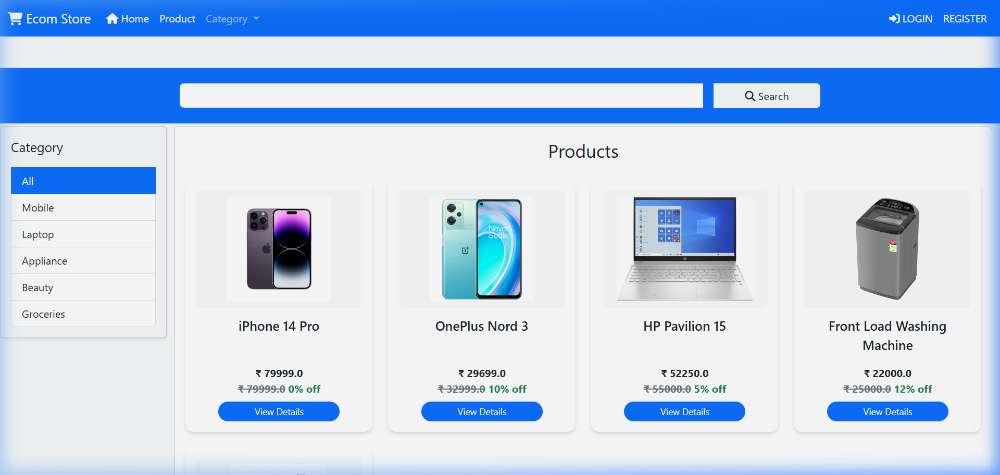
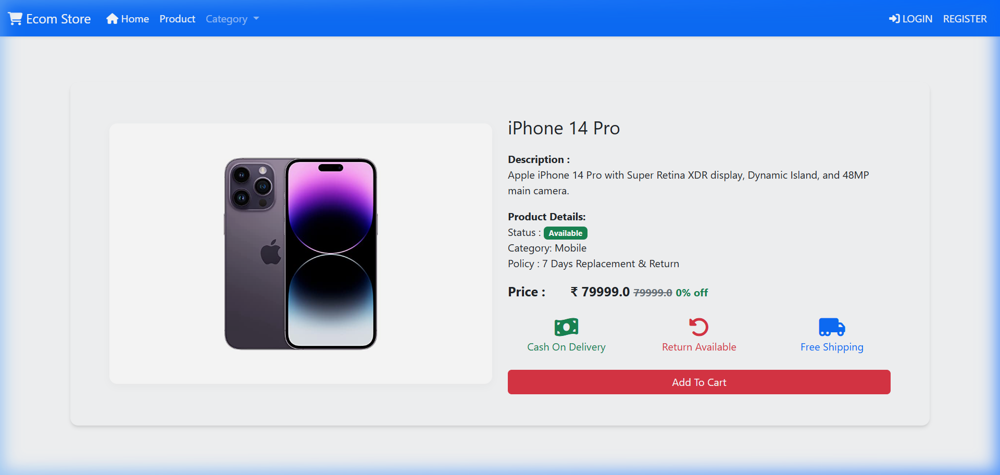
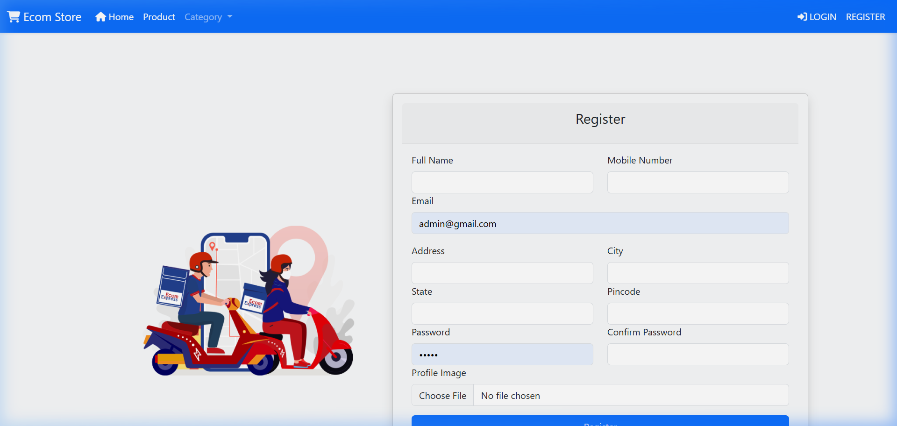
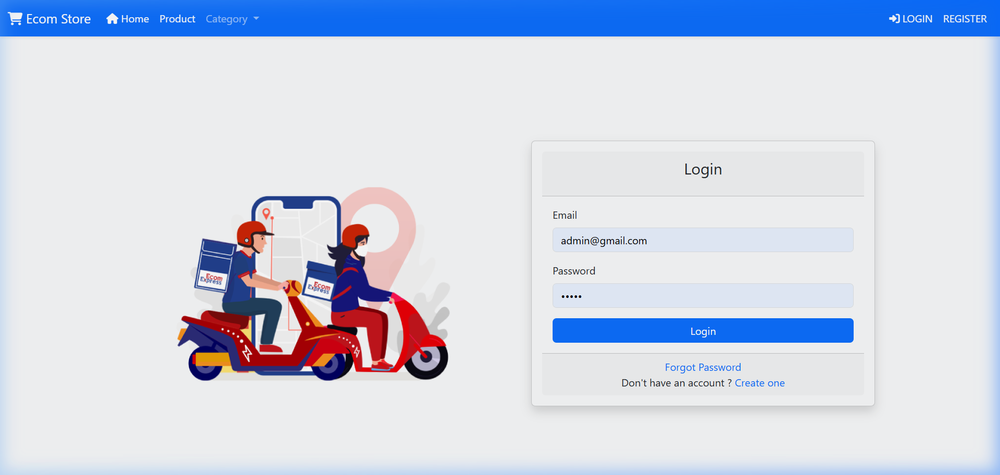

# 🛒 Spring Boot E-Commerce Store

[](https://e-commerce-spring-boot-e4ta.onrender.com/)
[](https://www.oracle.com/java/technologies/downloads/#java17)
[](https://spring.io/projects/spring-boot)

A modern, responsive, and full-featured E-Commerce web application built using **Spring Boot**, **Spring Security**, **Spring Data JPA**, and **Thymeleaf** with professional **Bootstrap 5** frontend designs.

---

## 🌐 Live Demo & Deployment
You can access the live application here:
🔗 **[https://e-commerce-spring-boot-e4ta.onrender.com/](https://e-commerce-spring-boot-e4ta.onrender.com/)**

> [!NOTE]
> The app is hosted on Render's free tier. If the server has gone idle due to inactivity, it may take **30-50 seconds** to start up on your first request.

---

## 🚀 Key Features

* **🔐 Security & Authentication**: Integrated user registration, secure login/logout, profile details page, and password recovery via automated reset emails (using Spring Security & Spring Mail).
* **📦 Product Catalog & Dynamic Filtering**: Custom category grids with hover micro-animations, product detail pages, and dynamic search/filter logic.
* **🛒 Interactive Shopping Cart**: Real-time quantity adjustments, cart item deletion, and interactive price/discount computation.
* **💳 Checkout & Order Processing**: User address selection, order status updates, and a receipt summary page.
* **🛡️ Admin Management Panel**: Comprehensive admin tools to add/edit products, add/edit categories, manage user roles, and update shipping statuses (Received, Dispatched, Out for Delivery, Delivered).
* **📱 Clean & Responsive UI**: Seamless viewing on mobile, tablet, and desktop screens with image aspect-ratio preservation (`object-fit`).

---

## 🛠️ Technology Stack

* **Backend**: Spring Boot 3.2.3, Spring Data JPA, Spring Security, Spring Mail
* **Frontend**: Thymeleaf, HTML5, CSS3, Bootstrap 5.3, Font Awesome 6.0
* **Database**: H2 Database (In-Memory for zero-config local runs) & MySQL (Production-ready)
* **Build System**: Maven Wrapper

---

## 📂 Project Structure

```text
E-commerce-spring-boot/
│
├── src/main/
│   ├── java/com/ecom/
│   │   ├── config/              # Spring Security and MVC configs
│   │   ├── controller/          # MVC Controllers (Admin, Home, User)
│   │   ├── model/               # JPA Entities (Cart, Category, Product, etc.)
│   │   ├── repository/          # JPA Repositories
│   │   ├── service/             # Business Logic interfaces
│   │   │   └── impl/            # Service Implementations
│   │   └── util/                # Utilities and DbSeeder for initial data
│   │
│   └── resources/
│       ├── static/              # CSS layouts, images, and validation JS
│       ├── templates/           # Thymeleaf templates (User & Admin views)
│       └── application.properties # Server and Database configuration
│
├── Docker/                      # Docker assets
├── images/                      # Documentation Screenshots
├── pom.xml                      # Maven configuration & dependencies
└── README.md                    # Project documentation
```

---

## ⚙️ Local Development Setup

The application features a **zero-configuration** default mode. By default, it runs on an **in-memory H2 database** and seeds basic test data (users, categories, products) automatically!

### Prerequisites
* **Java Development Kit (JDK) 17** or higher
* **Maven** (optional, wrapper is provided)

### Step 1: Clone the Repository
```bash
git clone https://github.com/amanverma420/E-commerce-spring-boot.git
cd E-commerce-spring-boot
```

### Step 2: Configure Properties (Optional)
Open `src/main/resources/application.properties` to customize settings. By default, the application runs on port `8080` with H2.

To switch to **MySQL**:
1. Create a MySQL database named `ecommerce_db`:
   ```sql
   CREATE DATABASE ecommerce_db;
   ```
2. Set the environment variables, or update the database configuration in `application.properties`:
   ```properties
   spring.datasource.url=jdbc:mysql://localhost:3306/ecommerce_db?createDatabaseIfNotExist=true
   spring.datasource.username=YOUR_MYSQL_USERNAME
   spring.datasource.password=YOUR_MYSQL_PASSWORD
   spring.datasource.driver-class-name=com.mysql.cj.jdbc.Driver
   spring.jpa.properties.hibernate.dialect=org.hibernate.dialect.MySQLDialect
   ```

### Step 3: Run the Application
Run the Maven wrapper command in your terminal from the project root:

**On Windows (PowerShell):**
```powershell
.\mvnw.cmd spring-boot:run
```

**On Windows (Command Prompt):**
```cmd
mvnw.cmd spring-boot:run
```

**On Linux / macOS:**
```bash
chmod +x mvnw
./mvnw spring-boot:run
```

Once running, navigate to:
* **Application**: [http://localhost:8080](http://localhost:8080)
* **H2 Database Console**: [http://localhost:8080/h2-console](http://localhost:8080/h2-console) (JDBC URL: `jdbc:h2:mem:ecommerce_db`, Username: `sa`, Password: *blank*)

---

## 🔑 Default Accounts (Auto-Seeded)

Upon the first startup, the database is auto-seeded with test accounts:

| Role | Email | Password | Details |
| :--- | :--- | :--- | :--- |
| **Administrator** | `admin@gmail.com` | `admin` | Full control over inventory, orders, and users. |
| **Normal User** | `user@gmail.com` | `user` | Pre-configured customer profile with items/orders. |

---

## 🖼️ Application Screenshots

<details>
<summary><b>🏠 Home Page & Category Navigation (Click to Expand)</b></summary>
<br/>

Includes a promotional carousel, clean category quick-links, and responsive product grids.

</details>

<details>
<summary><b>🛍️ Product Filters & Detail View (Click to Expand)</b></summary>
<br/>

Allows users to filter products by category or name. The detail view displays stock availability, price discounts, and shipping details.


</details>

<details>
<summary><b>🔐 Centered Authentications & Signups (Click to Expand)</b></summary>
<br/>

Clean, user-friendly registration and login interfaces.


</details>

---

## 🚀 Build & Deployment for Production

### Build Artifact
To generate the runnable fat JAR:
```bash
./mvnw clean package -DskipTests
```
The output file will be saved in `target/Shopping_Cart-0.0.1-SNAPSHOT.jar`.

### Running the JAR
```bash
java -jar target/Shopping_Cart-0.0.1-SNAPSHOT.jar
```
